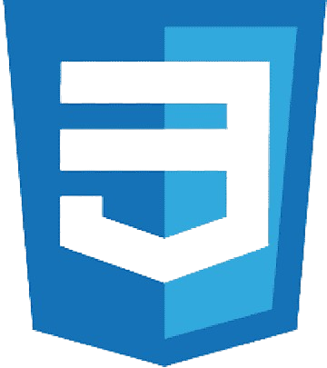

  <h1 align="center">Hey Dev! Welcome in My Profile! </h1>
  <h3 align="center"> I'm Santos André! A Systems Developer </h3>

  
 
  - 📍 I'm living in Paraná, Brazil. 
  
  - 💼 Currenctly I don't work, I'm search a job with Development or Support IT.
  
  - 💻 I'm dev Java with springboot & Angular for Front-end.
  
  - 📫 You can to reach with me by **contato.andre.santos@outlook.com** or WhatsApp +55 041 995368320.

  
   
  
  ##  📊 My Github Stats
  
  

    
    
  

  
  

      
  

  
  ###
  
   
  
  ##  🚀 Languages and Tools:

    
  
  
  
  
  

###
  
   
  
  
  ## 📲 Connect with me 
  
  

    <a href="https://www.instagram.com/andrefeh.22/" target="_blank">
      
    <a href="mailto:contato.andre.santos@outlook.com" target="_blank">
      
    
    
  

  
  ###
  
  ## ❤ Views and Followers
  
  
